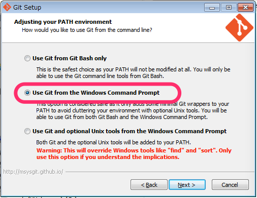

# ポータブル見積ツール meetoo


# 64bit環境のWindows7へのインストール手順

## 基本方針
32bit版バイナリを吐くように構成する.

64bit版はSQLite周りがうまく動かないので.


## Goインストール
### 本家の説明サイト
[http://golang-jp.org/doc/install](http://golang-jp.org/doc/install)

### インストーラダウンロードページ
[http://golang.org/dl/](http://golang.org/dl/)

※___必ず32bit版をダウンロードすること___

ZIPをダウロードして```c:¥go```に展開すること.

```c:¥go``` 以外の場所に展開してもいけるが、少しだけ設定が面倒になる.  

### 環境変数設定
環境変数```PATH```に```c:¥go¥bin```を追加すること.  
もし```c:¥go```以外の場所にZIPを展開している場合、環境変数の値のパスを書き換え、更に```GOROOT```という変数を追加すること. 値は展開したフォルダのパス.  

更に、任意のフォルダを作成して（例えば```c:¥gopath```）パスを環境変数```GOPATH```に設定すること.  
(これで作成したフォルダにGoのライブラリが格納されるようになる)

## Gitインストール
GoのライブラリをGitHubからダウンロードするのに必要

### インストーラダウンロードページ
[http://git-scm.com/download](http://git-scm.com/download)


※インストールに際してはコマンドプロンプトで使えるようにすること！  



## gccインストール
Goのライブラリのビルドに使われるgccをインストールしておく.  
MinGWとiいうソフトウェアでgccをインストールする.

### インストーラダウンロードページ

[http://sourceforge.net/projects/mingw/files/Installer/](http://sourceforge.net/projects/mingw/files/Installer/)

```mingw-get-setup.exe``` をクリックしてインストーラをダウンロードすること.

インストーラの実行にはインターネット接続が必要.

また上記ファイルはインストーラではあるが、基本的なファイルをインストールした後、追加でgccをインストールする必要がある.  
GUIで、```mingw32-gcc-g++```にチェックを付けた後、メニューの「Installation」→「Apply」を選択すると、インストールが始まる.


### 環境変数設定

環境変数```PATH```に```c:¥MinGW¥bin```を追加すること.

## zlib1.dllインストール
このdllはCのソースをGoから使うときに必要なようだが、Goに含まれていないため、別途インストールが必要.

[https://ljedit.googlecode.com/files/zlib1.zip](https://ljedit.googlecode.com/files/zlib1.zip)

解凍して現れる```zlib1.dll```を```c:¥MinGW¥bin```に置く.

[参考ページ(Yahoo!知恵袋)](http://detail.chiebukuro.yahoo.co.jp/qa/question_detail/q10140858135)


## meetooソースの取得と起動

### 必要なライブラリの取得

```
go get github.com/lib/pq
```

```
go get github.com/mattn/go-sqlite3
```

```
go get github.com/naoina/genmai
```

```
go get github.com/vincent-petithory/dataurl
```

```
go get github.com/zenazn/goji/web
```

### Goのライブラリをインストール

```
set GOARCH=386
go get ...
```


### meetooのソースの取得

```
go get github.com/jabaraster/meetoo
```

### 起動
ビルドなしでも起動は可能. 開発時はいちいちビルドしていられないので、この方法が有用.  
```
cd %gopath%\src\github.com\jabaraster\meetoo
set MEETOO_MODE=production
go run src\main.go
```

以下のURLにアクセス.

[http://localhost:8000/](http://localhost:8000/)

# 開発用ツール導入

meetooではgo以外の開発ツールとして以下のものを使っている.  

* [goemon](https://github.com/mattn/goemon)：lessやjsxなどの変換処理の必要なファイルを監視し、変更があったら変換コマンドを実行するツール
* [node.js](https://nodejs.org/)：less→CSS変換やjsx→js変換を行うコマンドを実行するのに必要. node.jsのパッケージ管理ソフトであるnpmもインストールする

## goemonインストール
これは簡単. go getするだけ.  

```
go get github.com/mattn/goemon/cmd/goemon
```

これで```goemon```というコマンドが実行可能になる.  

## node.jsとnpmのインストール


# ビルド手順

## ビルドコマンド
```
set GOARCH=386
go build -o meetoo.exe src¥main.go
```

## 起動
```
set MEETOO_MODE=production
meetoo.exe -bind=:8081
```

## 利用

ブラウザで次のURLを開く  

```
http://localhost:8081
```
